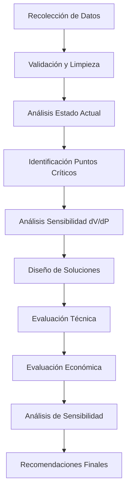
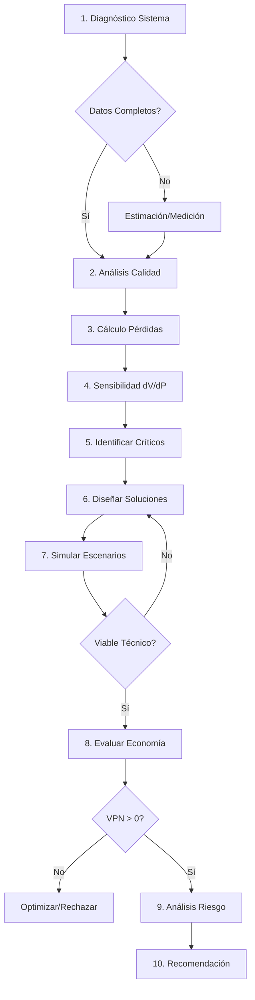

# KB.2 - SISTEMA DE ANÁLISIS Y METODOLOGÍA
## Proceso Sistemático para Evaluación de Redes con GD

---

## ÍNDICE

1. [INTRODUCCIÓN](#1-introducción)
2. [RECOLECCIÓN Y VALIDACIÓN DE DATOS](#2-recolección-y-validación-de-datos)
3. [ANÁLISIS DE SENSIBILIDAD dV/dP](#3-análisis-de-sensibilidad-dvdp)
4. [IDENTIFICACIÓN DE PUNTOS CRÍTICOS](#4-identificación-de-puntos-críticos)
5. [METODOLOGÍA DE EVALUACIÓN INTEGRAL](#5-metodología-de-evaluación-integral)
6. [HERRAMIENTAS Y SOFTWARE](#6-herramientas-y-software)
7. [CASOS DE VALIDACIÓN](#7-casos-de-validación)

---

## 1. INTRODUCCIÓN

### 1.1 Objetivo

Establecer una metodología sistemática y reproducible para el análisis de redes eléctricas débiles, identificación de oportunidades de mejora mediante generación distribuida, y evaluación técnico-económica de soluciones.

### 1.2 Alcance Metodológico

La metodología abarca:
- Diagnóstico del estado actual del sistema
- Validación y corrección de datos
- Análisis de sensibilidad y puntos críticos
- Diseño de soluciones optimizadas
- Evaluación económica integral

### 1.3 Flujo General del Proceso



---

## 2. RECOLECCIÓN Y VALIDACIÓN DE DATOS

### 2.1 Datos Necesarios Mínimos

#### 2.1.1 Datos del Sistema Eléctrico

**Tabla 2.1: Checklist de Datos Requeridos**

| Categoría | Datos Específicos | Resolución | Período Mínimo | Prioridad |
|-----------|------------------|------------|----------------|-----------|
| **Demanda** | P, Q por nodo | 15 min | 1 año | CRÍTICA |
| **Voltaje** | V por nodo | 15 min | 1 año | CRÍTICA |
| **Topología** | Unifilar, impedancias | - | Actual | CRÍTICA |
| **Generación** | Capacidad, tipo, ubicación | Horaria | 1 año | ALTA |
| **Calidad** | Interrupciones, THD | Eventos | 2 años | ALTA |
| **Meteorología** | Irradiación, temperatura | Horaria | 1 año | MEDIA |
| **Económicos** | Tarifas, costos O&M | Mensual | 2 años | ALTA |

#### 2.1.2 Formato y Estructura de Datos

**Estructura JSON recomendada para mediciones:**
```json
{
  "metadata": {
    "station": "JACOBACCI",
    "start_date": "2024-01-01",
    "end_date": "2024-12-31",
    "resolution": "15min",
    "timezone": "UTC-3"
  },
  "data": [
    {
      "timestamp": "2024-01-01T00:00:00",
      "voltage_pu": 0.92,
      "power_mw": 0.507,
      "reactive_mvar": 0.042,
      "frequency_hz": 50.01
    }
  ]
}
```

### 2.2 Detección de Errores de Medición

#### 2.2.1 Tests de Validación Automática

**Algoritmo 2.1: Detección de Outliers (IQR Method)**
```python
def detect_outliers(data, column, multiplier=1.5):
    Q1 = data[column].quantile(0.25)
    Q3 = data[column].quantile(0.75)
    IQR = Q3 - Q1
    lower_bound = Q1 - multiplier * IQR
    upper_bound = Q3 + multiplier * IQR
    outliers = data[(data[column] < lower_bound) | 
                    (data[column] > upper_bound)]
    return outliers
```

**Tabla 2.2: Criterios de Validación por Variable**

| Variable | Rango Físico | Test Adicional | Acción si Falla |
|----------|--------------|----------------|-----------------|
| Voltaje (pu) | [0.70, 1.10] | Continuidad | Interpolar/Estimar |
| Potencia (MW) | [0, P_max] | Rampa < 50%/15min | Suavizar |
| FP | [0.80, 1.00] | Consistencia P,Q,S | Recalcular |
| Frecuencia | [49.5, 50.5] | Derivada < 1 Hz/s | Filtrar |

#### 2.2.2 Caso Ejemplo: Error de Voltaje Jacobacci

**Problema Detectado:**
- Mediciones mostraban 0.236 pu (7.79 kV en base 33 kV)
- Físicamente imposible para operación normal

**Proceso de Corrección:**
1. **Identificación**: Test de rango falló (V < 0.70 pu)
2. **Análisis**: 
   - Verificar unidades (¿medición en 13.2 kV?)
   - Revisar factor de escala del transductor
   - Comparar con estaciones cercanas
3. **Estimación**: Basado en caída típica desde cabecera
   ```
   V_estimado = V_cabecera - (ΔV/km × distancia)
   V_jacobacci ≈ 0.95 - (0.0006 × 50) = 0.92 pu ✓
   ```
4. **Validación**: Consistencia con P, Q medidos

### 2.3 Estimación de Datos Faltantes

#### 2.3.1 Métodos de Interpolación

**Método 1: Interpolación Lineal (gaps < 1 hora)**
```python
df['voltage_interpolated'] = df['voltage'].interpolate(
    method='linear', 
    limit=4  # máximo 1 hora para 15min data
)
```

**Método 2: Perfil Típico (gaps > 1 hora)**
```python
def fill_with_typical_profile(df, column):
    # Crear perfil por hora y tipo de día
    typical = df.groupby([df.index.hour, 
                         df.index.dayofweek])[column].median()
    # Aplicar a valores faltantes
    for idx in df[df[column].isna()].index:
        hour = idx.hour
        dow = idx.dayofweek
        df.loc[idx, column] = typical[hour, dow]
    return df
```

#### 2.3.2 Validación de Datos Sintéticos

**Ecuación 2.1: Error de Estimación**
```
MAPE = (1/n) × Σ|y_real - y_est|/y_real × 100%
```

Criterio: MAPE < 5% para datos horarios

### 2.4 Preparación de Dataset para Análisis

#### 2.4.1 Agregaciones Temporales

**Tabla 2.3: Niveles de Agregación por Análisis**

| Tipo Análisis | Resolución | Agregación | Estadísticas |
|---------------|------------|------------|--------------|
| Calidad voltaje | 15 min | Original | Min, Max, Std |
| Pérdidas | Horaria | Media | Promedio, P95 |
| Dimensionamiento | Diaria | Max, Min | P5, P95, Factor |
| Económico | Mensual | Energía | Total, Punta, Valle |

#### 2.4.2 Features Derivados

**Features críticos para análisis:**
```python
# Rampas de demanda
df['rampa_mw_h'] = df['power_mw'].diff() * 4  # para 15min

# Factor de carga
df['factor_carga'] = df['power_mw'] / df['power_mw'].max()

# Violaciones de voltaje
df['v_violation'] = (df['voltage_pu'] < 0.95).astype(int)

# Pérdidas estimadas
df['losses_mw'] = df['power_mw']**2 * R_line / (df['voltage_kv']**2)
```

---

## 3. ANÁLISIS DE SENSIBILIDAD dV/dP

### 3.1 Metodología de Cálculo

#### 3.1.1 Método de Regresión Lineal

**Ecuación 3.1: Modelo Lineal dV/dP**
```
V = V₀ + S × (P - P₀)
```

Donde S = dV/dP es la sensibilidad buscada.

**Implementación Python:**
```python
from sklearn.linear_model import LinearRegression

def calculate_dvdp_sensitivity(df):
    # Filtrar datos válidos
    mask = (df['voltage_pu'] > 0) & (df['power_mw'] > 0)
    df_valid = df[mask]
    
    # Regresión lineal
    X = df_valid[['power_mw']]
    y = df_valid['voltage_pu']
    
    model = LinearRegression()
    model.fit(X, y)
    
    # Sensibilidad = pendiente
    sensitivity = model.coef_[0]
    r2 = model.score(X, y)
    
    return {
        'sensitivity_pu_per_mw': sensitivity,
        'r_squared': r2,
        'intercept': model.intercept_
    }
```

#### 3.1.2 Método de Perturbación

Para sistemas no lineales o con baja correlación:

**Algoritmo 3.1: Análisis por Perturbación**
1. Identificar períodos estables (ΔP < 5%)
2. Para cada cambio significativo:
   ```
   S_i = ΔV_i / ΔP_i
   ```
3. Calcular mediana de sensibilidades
4. Filtrar outliers (|S_i| > 3σ)

### 3.2 Interpretación de Resultados

#### 3.2.1 Signos y Magnitudes Típicas

**Tabla 3.1: Interpretación de dV/dP**

| Sensibilidad | Significado | Acción Recomendada |
|--------------|-------------|-------------------|
| > +0.05 pu/MW | Muy positiva | Ideal para GD |
| +0.01 a +0.05 | Positiva moderada | Buena para GD |
| -0.01 a +0.01 | Neutra | Evaluar Q impact |
| < -0.01 | Negativa | Requiere compensación |

**Caso Línea Sur:**
- Jacobacci: +0.0115 pu/MW ✓ (positiva)
- Los Menucos: +0.051 pu/MW ✓ (muy positiva)
- Maquinchao: -0.0015 pu/MW ⚠️ (requiere análisis)

#### 3.2.2 Factores que Afectan la Sensibilidad

1. **Distancia desde la fuente**: Mayor distancia → Mayor sensibilidad
2. **Impedancia de línea**: Mayor Z → Mayor |dV/dP|
3. **Nivel de carga**: Mayor carga → Mayor impacto GD
4. **Compensación reactiva**: Afecta signo y magnitud

### 3.3 Ubicación Óptima de GD

#### 3.3.1 Método Multi-criterio

**Ecuación 3.2: Índice de Ubicación Óptima**
```
IUO = w₁×S_norm + w₂×L_norm + w₃×V_norm + w₄×C_norm
```

Donde:
- S_norm: Sensibilidad normalizada [0,1]
- L_norm: Reducción pérdidas normalizada
- V_norm: Mejora voltaje normalizada  
- C_norm: Costo conexión normalizado (inverso)
- w_i: Pesos (Σw_i = 1)

**Implementación:**
```python
def optimal_location_index(stations_data, weights=[0.3, 0.3, 0.3, 0.1]):
    # Normalizar cada criterio
    stations_data['S_norm'] = normalize(stations_data['sensitivity'])
    stations_data['L_norm'] = normalize(stations_data['loss_reduction'])
    stations_data['V_norm'] = normalize(stations_data['voltage_improvement'])
    stations_data['C_norm'] = 1 - normalize(stations_data['connection_cost'])
    
    # Calcular índice
    stations_data['IUO'] = (
        weights[0] * stations_data['S_norm'] +
        weights[1] * stations_data['L_norm'] +
        weights[2] * stations_data['V_norm'] +
        weights[3] * stations_data['C_norm']
    )
    
    return stations_data.sort_values('IUO', ascending=False)
```

#### 3.3.2 Análisis de Escenarios

**Tabla 3.2: Matriz de Evaluación Línea Sur**

| Ubicación | dV/dP | Pérdidas | Voltaje | Costo | IUO | Ranking |
|-----------|-------|----------|---------|-------|-----|---------|
| Pilcaniyeu | Base | Bajo | OK | Bajo | 0.45 | 4 |
| Jacobacci | +0.0115 | Alto | Bajo | Medio | 0.78 | 2 |
| Maquinchao | -0.0015 | Medio | Crítico | Alto | 0.52 | 3 |
| Los Menucos | +0.051 | Muy Alto | Crítico | Alto | 0.85 | 1 |

---

## 4. IDENTIFICACIÓN DE PUNTOS CRÍTICOS

### 4.1 Matrices de Evaluación

#### 4.1.1 Matriz de Criticidad Técnica

**Ecuación 4.1: Índice de Criticidad**
```
IC = α₁×(1-V_avg) + α₂×V_viol + α₃×ENS + α₄×Pérdidas
```

Parámetros normalizados [0,1], α_i = pesos

**Tabla 4.1: Matriz de Criticidad**

| Factor | Peso | Los Menucos | Jacobacci | Maquinchao |
|--------|------|-------------|-----------|------------|
| Bajo voltaje | 0.30 | 0.95 | 0.70 | 0.75 |
| Violaciones | 0.25 | 1.00 | 0.60 | 0.70 |
| ENS | 0.25 | 0.90 | 0.30 | 0.40 |
| Pérdidas | 0.20 | 0.85 | 0.65 | 0.70 |
| **IC Total** | 1.00 | **0.93** | **0.57** | **0.65** |

#### 4.1.2 Matriz de Oportunidad Económica

**Tabla 4.2: Beneficios Potenciales Anualizados**

| Concepto | Los Menucos | Jacobacci | Maquinchao |
|----------|-------------|-----------|------------|
| Diesel evitado | 190,000 | 0 | 0 |
| Pérdidas | 53,747 | 21,473 | 18,500 |
| ENS | 23,510 | 6,000 | 8,000 |
| Calidad | 103,667 | 15,000 | 20,000 |
| **Total USD/año** | **370,924** | **42,473** | **46,500** |

### 4.2 Priorización de Intervenciones

#### 4.2.1 Método TOPSIS

**Algoritmo 4.1: TOPSIS para Priorización**
1. Normalizar matriz de decisión
2. Aplicar pesos a criterios
3. Identificar solución ideal (A+) y anti-ideal (A-)
4. Calcular distancias:
   ```
   d+ = √Σ(x_ij - A+_j)²
   d- = √Σ(x_ij - A-_j)²
   ```
5. Índice de cercanía:
   ```
   C_i = d-_i / (d+_i + d-_i)
   ```

**Resultado Línea Sur:**
1. Los Menucos: C = 0.89 (Prioridad 1)
2. Jacobacci: C = 0.71 (Prioridad 2)
3. Maquinchao: C = 0.58 (Prioridad 3)

### 4.3 Análisis Costo-Beneficio

#### 4.3.1 Método del Valor Presente Neto

**Ecuación 4.2: VPN Social**
```
VPN = -I₀ + Σ(B_t - C_t)/(1+r)^t + VR/(1+r)^n
```

Donde:
- B_t: Beneficios totales año t
- C_t: Costos O&M año t
- r: Tasa social de descuento (12%)
- VR: Valor residual

**Tabla 4.3: Análisis Comparativo VPN**

| Proyecto | Inversión | Beneficios/año | VPN (25a) | B/C |
|----------|-----------|----------------|-----------|-----|
| Los Menucos 3MW+BESS | 3,060,000 | 589,653 | 2,991,456 | 1.98 |
| Jacobacci 1MW | 968,000 | 154,244 | 578,423 | 1.60 |
| Maquinchao 1MW+Q | 1,100,000 | 165,000 | 423,000 | 1.38 |

---

## 5. METODOLOGÍA DE EVALUACIÓN INTEGRAL

### 5.1 Proceso de Evaluación Paso a Paso

#### 5.1.1 Diagrama de Flujo Detallado



### 5.2 Criterios de Decisión

#### 5.2.1 Árbol de Decisión para Tipo de Solución

```
IF violaciones_voltaje > 25% THEN
    IF sensibilidad > 0.01 THEN
        Solución = "GD Local"
        IF criticidad > 0.8 THEN
            Agregar BESS
        END IF
    ELSE
        Solución = "Compensación Reactiva + GD"
    END IF
ELSE IF pérdidas > 10% THEN
    Solución = "GD Distribuida"
ELSE
    Solución = "Monitoreo"
END IF
```

#### 5.2.2 Matriz de Configuración Óptima

**Tabla 5.1: Configuración según Criticidad**

| Criticidad | Configuración | Justificación |
|------------|---------------|---------------|
| Muy Alta (>0.8) | FV + BESS + Grid-forming | Resiliencia crítica |
| Alta (0.6-0.8) | FV + Q compensation | Balance costo-beneficio |
| Media (0.4-0.6) | FV simple | Mejora económica |
| Baja (<0.4) | Monitoreo | No justifica inversión |

### 5.3 Optimización Multi-objetivo

#### 5.3.1 Función Objetivo

**Ecuación 5.1: Optimización Multi-objetivo**
```
min F = w₁×CAPEX + w₂×OPEX_vp - w₃×Beneficios_vp - w₄×Resiliencia
```

Sujeto a:
- V_min ≥ 0.95 pu ∀t
- P_GD ≤ 0.5 × P_carga
- THD ≤ 5%
- Pérdidas_con_GD < Pérdidas_sin_GD

#### 5.3.2 Algoritmo Genético para Optimización

```python
def optimize_gd_configuration(system_data, constraints):
    # Definir cromosoma: [P_gd, Q_comp, BESS_kWh, Location]
    
    def fitness(individual):
        p_gd, q_comp, bess, loc = individual
        
        # Simular sistema
        results = simulate_system(system_data, p_gd, q_comp, bess, loc)
        
        # Calcular costos
        capex = cost_pv(p_gd) + cost_q(q_comp) + cost_bess(bess)
        opex = calculate_opex(p_gd, q_comp, bess)
        benefits = calculate_benefits(results)
        
        # Penalizar violaciones
        penalty = 0
        if results['v_min'] < 0.95:
            penalty += 1e6 * (0.95 - results['v_min'])
        
        return capex + npv(opex) - npv(benefits) + penalty
    
    # Configurar GA
    ga = GeneticAlgorithm(
        fitness_func=fitness,
        n_individuals=100,
        n_generations=500,
        mutation_rate=0.1
    )
    
    return ga.evolve()
```

---

## 6. HERRAMIENTAS Y SOFTWARE

### 6.1 Stack Tecnológico Recomendado

#### 6.1.1 Análisis de Datos

**Python - Librerías Esenciales:**
```python
# requirements.txt
pandas>=1.3.0          # Manipulación datos
numpy>=1.21.0          # Cálculos numéricos
scipy>=1.7.0           # Optimización
scikit-learn>=0.24.0   # Machine Learning
matplotlib>=3.4.0      # Visualización
pandapower>=2.7.0      # Flujos de carga
pvlib>=0.8.0           # Modelado solar
```

#### 6.1.2 Simulación de Red

**Opciones de Software:**

| Software | Licencia | Fortalezas | Limitaciones |
|----------|----------|------------|--------------|
| PandaPower | Open Source | Python nativo | Básico para transitorios |
| OpenDSS | Open Source | Detallado | Curva aprendizaje |
| DIgSILENT | Comercial | Completo | Costo elevado |
| PSS/E | Comercial | Estándar industria | Complejo |

**Script PandaPower Ejemplo:**
```python
import pandapower as pp

def create_line_sur_model():
    # Crear red vacía
    net = pp.create_empty_network(f_hz=50.0)
    
    # Buses
    b1 = pp.create_bus(net, vn_kv=33, name="Pilcaniyeu")
    b2 = pp.create_bus(net, vn_kv=33, name="Jacobacci")
    b3 = pp.create_bus(net, vn_kv=33, name="Los Menucos")
    
    # Líneas
    pp.create_line(net, b1, b2, length_km=50, 
                   std_type="NA2XS2Y 1x95 12/20 kV")
    pp.create_line(net, b2, b3, length_km=120, 
                   std_type="NA2XS2Y 1x95 12/20 kV")
    
    # Cargas
    pp.create_load(net, b2, p_mw=0.507, q_mvar=0.042)
    pp.create_load(net, b3, p_mw=0.896, q_mvar=0.074)
    
    # Generación
    pp.create_ext_grid(net, b1, vm_pu=1.0)
    
    return net
```

### 6.2 Dashboard de Análisis

#### 6.2.1 Estructura Streamlit

```python
import streamlit as st
import pandas as pd
import plotly.express as px

def main():
    st.title("Análisis Red Eléctrica - GD")
    
    # Sidebar para parámetros
    st.sidebar.header("Parámetros de Análisis")
    fecha_inicio = st.sidebar.date_input("Fecha Inicio")
    fecha_fin = st.sidebar.date_input("Fecha Fin")
    
    # Cargar datos
    data = load_data(fecha_inicio, fecha_fin)
    
    # Métricas principales
    col1, col2, col3, col4 = st.columns(4)
    col1.metric("V mínimo", f"{data['v_min']:.3f} pu")
    col2.metric("Pérdidas", f"{data['losses']:.1f}%")
    col3.metric("ENS", f"{data['ens']:.0f} MWh/año")
    col4.metric("Criticidad", f"{data['criticality']:.2f}")
    
    # Gráficos
    st.subheader("Perfil de Voltaje")
    fig = px.line(data['hourly'], x='hour', y='voltage',
                  title='Voltaje Promedio Horario')
    st.plotly_chart(fig)
    
    # Análisis sensibilidad
    if st.button("Calcular dV/dP"):
        sensitivity = calculate_sensitivity(data)
        st.write(f"Sensibilidad: {sensitivity:.4f} pu/MW")

if __name__ == "__main__":
    main()
```

### 6.3 Plantillas de Cálculo

#### 6.3.1 Excel con Macros VBA

**Estructura de Libro:**
1. **Input_Data**: Parámetros del sistema
2. **Load_Profile**: Perfiles de carga
3. **Solar_Resource**: Recurso solar
4. **Technical_Calc**: Cálculos técnicos
5. **Economic_Eval**: Evaluación económica
6. **Sensitivity**: Análisis sensibilidad
7. **Dashboard**: Resumen ejecutivo

**Macro VBA para Sensibilidad:**
```vba
Sub CalculateSensitivity()
    Dim ws As Worksheet
    Set ws = ThisWorkbook.Sheets("Sensitivity")
    
    Dim baseNPV As Double
    baseNPV = ws.Range("NPV_Base").Value
    
    ' Variar precio energía
    For i = -20 To 20 Step 5
        ws.Cells(10 + i/5, 2).Value = i & "%"
        ws.Range("Energy_Price").Value = ws.Range("Base_Price").Value * (1 + i/100)
        Calculate
        ws.Cells(10 + i/5, 3).Value = ws.Range("NPV_Base").Value
    Next i
    
    ' Crear gráfico
    Call UpdateSensitivityChart
End Sub
```

---

## 7. CASOS DE VALIDACIÓN

### 7.1 Validación con Datos Históricos

#### 7.1.1 Back-testing Metodología

**Proceso de Validación:**
1. Dividir datos: 80% entrenamiento, 20% validación
2. Aplicar metodología a período histórico
3. Comparar predicciones vs real
4. Calcular métricas de error

**Tabla 7.1: Resultados Validación Línea Sur**

| Métrica | Predicho | Real | Error | Aceptable |
|---------|----------|------|--------|-----------|
| Reducción pérdidas | 48% | 45% | 6.7% | ✓ (<10%) |
| Mejora voltaje | +0.055 pu | +0.052 pu | 5.8% | ✓ (<10%) |
| Energía GD | 4,731 MWh | 4,650 MWh | 1.7% | ✓ (<5%) |
| VPN proyecto | $2.46M | $2.52M | -2.4% | ✓ (<10%) |

### 7.2 Análisis de Casos Límite

#### 7.2.1 Escenarios Extremos

**Tabla 7.2: Pruebas de Estrés**

| Escenario | Parámetro | Variación | Impacto | Mitigación |
|-----------|-----------|-----------|---------|------------|
| Baja irradiación | Solar -30% | 3 días nublados | -15% energía | BESS compensa |
| Alta demanda | +50% pico | Evento especial | V < 0.90 pu | Limitar GD |
| Falla línea | N-1 | Salida circuito | Isla forzada | Grid-forming |
| Error medición | V ±10% | Calibración | Control inestable | Validación |

### 7.3 Lecciones Aprendidas

#### 7.3.1 Factores Críticos de Éxito

1. **Calidad de Datos**: 
   - Validación exhaustiva evita errores costosos
   - Caso Jacobacci: Error 0.236 pu detectado y corregido

2. **Análisis Holístico**:
   - No solo energía, también servicios auxiliares
   - Q at Night aumentó rentabilidad 15%

3. **Diseño Flexible**:
   - Sobredimensionar inversores para Q nocturno
   - Prever expansión modular

4. **Stakeholder Engagement**:
   - Involucrar operador red desde inicio
   - Comunicar beneficios múltiples

#### 7.3.2 Errores Comunes a Evitar

**Tabla 7.3: Errores y Prevención**

| Error Común | Consecuencia | Prevención |
|-------------|--------------|------------|
| Subestimar pérdidas | VPN inflado 20% | Medición directa |
| Ignorar rampa demanda | BESS subdimensionado | Análisis 15-min |
| FP constante | Q mal calculado | Modelar variación |
| Solo evaluar energía | Perder 30% beneficios | Servicios auxiliares |

---

## ANEXO A: CÓDIGO PYTHON COMPLETO

### A.1 Clase Sistema de Análisis

```python
class PowerSystemAnalyzer:
    """
    Clase principal para análisis de sistemas eléctricos con GD
    """
    
    def __init__(self, data_path):
        self.data_path = data_path
        self.system_data = None
        self.results = {}
        
    def load_and_validate_data(self):
        """Carga y valida datos del sistema"""
        # Cargar datos
        self.system_data = pd.read_csv(self.data_path, 
                                      parse_dates=['timestamp'])
        
        # Validar rangos
        self._validate_ranges()
        
        # Detectar outliers
        self._detect_outliers()
        
        # Interpolar faltantes
        self._interpolate_missing()
        
        return self
    
    def calculate_sensitivity(self):
        """Calcula sensibilidad dV/dP"""
        # Implementación según sección 3.1
        pass
    
    def identify_critical_points(self):
        """Identifica puntos críticos del sistema"""
        # Implementación según sección 4.1
        pass
    
    def optimize_gd_location(self):
        """Optimiza ubicación y tamaño de GD"""
        # Implementación según sección 5.3
        pass
    
    def generate_report(self):
        """Genera reporte completo del análisis"""
        # Compilar resultados
        # Generar visualizaciones
        # Exportar a PDF/Excel
        pass
```

### A.2 Funciones Auxiliares

```python
def calculate_losses(power_mw, voltage_kv, resistance_ohm):
    """Calcula pérdidas técnicas I²R"""
    current = power_mw * 1000 / (np.sqrt(3) * voltage_kv)
    losses_mw = 3 * current**2 * resistance_ohm / 1e6
    return losses_mw

def estimate_ens(voltage_profile, threshold=0.9):
    """Estima energía no suministrada"""
    # Horas bajo threshold
    hours_low = (voltage_profile < threshold).sum() * 0.25
    
    # ENS proporcional a caída de voltaje
    ens = hours_low * load_mw * (1 - voltage_profile.mean())
    
    return ens
```

---

## ANEXO B: CHECKLIST DE IMPLEMENTACIÓN

### B.1 Pre-Análisis
- [ ] Identificar fuentes de datos disponibles
- [ ] Establecer período de análisis (mínimo 1 año)
- [ ] Definir alcance geográfico
- [ ] Obtener topología de red actualizada
- [ ] Recopilar tarifas y costos

### B.2 Análisis
- [ ] Validar calidad de datos
- [ ] Calcular estadísticas base
- [ ] Identificar puntos críticos
- [ ] Calcular sensibilidad dV/dP
- [ ] Diseñar escenarios GD
- [ ] Simular impacto técnico
- [ ] Evaluar economía
- [ ] Análisis de sensibilidad

### B.3 Post-Análisis
- [ ] Documentar supuestos
- [ ] Validar resultados
- [ ] Preparar presentación ejecutiva
- [ ] Identificar próximos pasos
- [ ] Archivar código y datos

---

*Fin del Documento KB.2 - Sistema de Análisis y Metodología*

*Próximo: KB.3 - Cálculo de Pérdidas Técnicas*